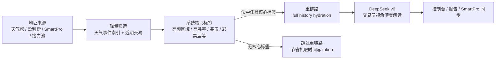

# Finder App

> Polymarket weather wallet intelligence console.
> 面向天气赛道的钱包筛选、链上行为归因、系统标签、DeepSeek 深度解读与 SmartPro 同步工具。

[](https://www.python.org/)
[](https://react.dev/)
[](https://vite.dev/)
[](https://www.deepseek.com/)
[](#数据与产物)

Finder App 把 Polymarket 天气赛道里最耗时间的几件事串成一条可复用的分析链路：

- 先轻量抓取排行榜、天气事件索引和近期交易信号。
- 再给钱包打系统核心标签，判断它是不是值得进入重链路。
- 命中任意系统核心标签的钱包才进入 full history hydration 和 DeepSeek v6 深度分析。
- 结果可在本地控制台查看、接力续跑、清理归档，并可同步到 SmartPro。

## 为什么做这个

天气市场的钱包分析很容易被两类噪声拖慢：一类是无标签、无结构化证据的钱包，另一类是混进来的非天气交易。Finder App 的目标不是“尽量多跑 AI”，而是先用结构化规则把真正有天气行为特征的钱包找出来，再把更贵的全量抓取和 DeepSeek token 用在有价值的地址上。

## 核心能力

| 能力 | 说明 |
| --- | --- |
| 轻量筛选 | 从天气排行榜、盈利榜或导入地址池中生成候选，快速计算天气交易占比、活跃度、主区域、低成本交易、胜率等信号。 |
| 系统核心标签 | 统一所有模式的业务门槛：命中任意系统核心标签，才有资格进入 full history hydration 与 DeepSeek 深度分析。 |
| DeepSeek v6 深度解读 | 自研 `finder-weather-brief-v6` 前置 prompt，要求 DeepSeek 像交易员一样解释钱包的战场、节奏、利润路径和脆弱点。 |
| 接力分析 | 从某一轮原始地址池里筛选“未完成 DeepSeek / 已完成 DeepSeek / 核心标签 / 非核心标签”地址，重新建立独立接力任务。 |
| Smart Wallet 刷新 | 导入 SmartPro 地址库，走单独的地址库刷新链路，重新拉取近期行为并补充 Finder 标签。 |
| SmartPro 同步 | 将 Finder 结果打包为 SmartPro 可导入 payload，支持分批提交和同步状态反馈。 |
| 运行诊断 | 运行页展示天气索引、候选预筛、当前批次、full hydration、DeepSeek gate reason、失败/跳过原因等状态。 |
| 历史复用 | 本地 history ledger + 可选 Cloudflare D1，把交易、操作、gap 与归档结果沉淀为可复用数据层。 |

## 分析链路



这条门槛是统一的：普通分析、盈利榜分析、Smart Wallet 刷新、接力分析都会先做轻量筛选和系统核心标签，再决定是否进入重链路。

## DeepSeek v6 深度解读

当前 DeepSeek 生成链路使用：

```text
finder-weather-brief-v6
```

v6 的重点不是把标签翻译成中文，而是把结构化证据转成可读的钱包画像：

- 用 `behaviorSnapshot`、`coverage`、`tradeSamples` 作为主要证据。
- 用 `profileSnapshot`、`operationAuditSnapshot`、`topTrades` 解释执行风格和收益路径。
- 自动拒绝乱码、缺字段、空洞输出，并触发一次修复重试。
- 保护高质量中文输出，避免被本地模板化后处理覆盖。
- 不把 `Science`、`Global Temp` 这类主题组误写成城市。
- 非天气 `topTrades` 只作为组合背景，不作为天气结论证据。

DeepSeek gate 不会被放宽。钱包必须先有系统核心标签和足够结构化证据，才会进入 AI 深度解读。

## 分析模式

| 模式 | 适用场景 | 路径 |
| --- | --- | --- |
| 普通分析 | 从天气排行榜寻找新钱包 | 排行榜 -> 轻量筛选 -> 核心标签 -> 重链路 -> DeepSeek |
| 本周高盈利榜 | 从周盈利榜寻找高价值天气钱包 | 盈利榜 -> 独立筛选参数 -> 核心标签 -> 重链路 -> DeepSeek |
| Smart Wallet 刷新 | 刷新 SmartPro 地址库里的已知地址 | 导入地址库 -> 近期行为 -> 重新打标 -> 可同步回 SmartPro |
| 接力分析 | 从上一轮未完成的钱包继续跑 | 原始地址池 -> 可选筛选 -> 独立任务 -> 跳过已完成地址 |

接力分析和 Smart Wallet 刷新是两条不同功能链路：前者面向某次 Finder 运行的原始地址池，后者面向外部地址库刷新。

## 控制台页面

| 页面 | 用途 |
| --- | --- |
| Dashboard | 最近任务、标签分布、重点钱包概览。 |
| New analysis | 创建普通分析、盈利榜分析、Smart Wallet 刷新、接力分析。 |
| Run status | 查看进度、卡点、天气索引、hydration、DeepSeek gate reason。 |
| Wallet list | 钱包列表、搜索、标签筛选、SmartPro 同步。 |
| Wallet detail | 指标、标签证据、交易样本、DeepSeek 深度解读。 |
| Reports | 查看报告、JSON 产物与运行文件。 |
| Settings / Cleanup | SmartPro 配置状态、历史记录、缓存和产物清理。 |

## 快速开始

### 1. 安装 Python 包

```powershell
pip install -e .
```

也可以直接按源码运行：

```powershell
$env:PYTHONPATH = "$PWD\src"
python -m polymarket_weather_tool --config configs/default_config.json
```

### 2. 安装前端依赖

```powershell
Set-Location frontend
npm ci
```

### 3. 启动本地 API

```powershell
$env:PYTHONPATH = "$PWD\src"
python -m polymarket_weather_tool.server --host 127.0.0.1 --port 41874
```

### 4. 启动控制台

```powershell
Set-Location frontend
npm run dev
```

默认地址：

```text
API:      http://127.0.0.1:41874
Console:  http://127.0.0.1:41873
```

Windows 本地可直接使用：

```text
scripts/Open-PolymarketWeather.vbs
scripts/Open-PolymarketWeather.ps1
```

## 命令行示例

```powershell
polymarket-weather `
  --config configs/default_config.json `
  --output-dir artifacts/demo-run `
  --target-count 5 `
  --fetch-limit 20 `
  --max-weather-events 100000 `
  --max-wallet-offset 1000 `
  --concurrent-wallets 4 `
  --verbose
```

## 环境变量

敏感信息不要提交到仓库。请使用本地 `.env`，仓库只保留 `.env.example` 占位。

常用变量：

| 变量 | 说明 |
| --- | --- |
| `DEEPSEEK_API_KEY` | DeepSeek 生成所需 API key。 |
| `DEEPSEEK_MODEL` | 默认 `deepseek-v4-flash`，可本地覆盖。 |
| `DEEPSEEK_BASE_URL` | DeepSeek API base URL。 |
| `ETHERSCAN_API_KEY` / `POLYGONSCAN_API_KEY` | 链上验证与 split 证据。 |
| `SMART_PRO_BASE_URL` | SmartPro 后台地址。 |
| `SMART_PRO_FINDER_TOKEN` | Finder -> SmartPro 同步 token。 |
| `CLOUDFLARE_ACCOUNT_ID` / `CLOUDFLARE_D1_DATABASE_ID` | 可选 D1 历史层配置。 |

## 数据与产物

每次运行通常写入：

```text
artifacts/<run_id>/
  analysis_summary.json
  errors.json
  leaderboard.json
  progress.log
  report.txt
  resolved_config.json
  screening_records.json
  selected_wallets.json
  weather_events.json
  wallets/*.json
```

本地复用数据：

```text
artifacts/_wallet_registry/
artifacts/_history_ledger/
artifacts/_smart_wallet_library/
.cache/finder-ai/
.cache/polymarket-weather-tool/
```

## API 概览

| API | 说明 |
| --- | --- |
| `GET /api/health` | 健康检查。 |
| `POST /api/runs` | 创建分析任务。 |
| `GET /api/runs` | 列出运行记录。 |
| `GET /api/runs/{run_id}/summary` | 运行摘要与诊断。 |
| `GET /api/runs/{run_id}/wallets` | 分页读取钱包列表。 |
| `GET /api/runs/{run_id}/wallets/{wallet}` | 钱包详情。 |
| `POST /api/runs/{run_id}/resume` | 继续未完成任务。 |
| `POST /api/runs/{run_id}/relay-import` | 从历史运行构建接力地址池。 |
| `POST /api/smart-pro/import/commit` | 同步 Finder 结果到 SmartPro。 |
| `GET /api/history/cloud/status` | 查看本地/Cloudflare 历史层状态。 |

## 验证

```powershell
python -m unittest discover -s tests -p "test_*.py"
```

```powershell
Set-Location frontend
npm run lint
npm run build
```

## 版本记录

- 最新版本与历史更新见 [CHANGELOG.md](CHANGELOG.md)。
- v0.2.0 发布说明见 [docs/release/20260509190000000_finder_ai_v6_relay_analysis.md](docs/release/20260509190000000_finder_ai_v6_relay_analysis.md)。
- Cloudflare D1 历史层说明见 [docs/release/20260507123000000_cloudflare_d1_history_persistence.md](docs/release/20260507123000000_cloudflare_d1_history_persistence.md)。

## 许可证

本仓库当前未声明开源许可证。如需对外开放复用，请先补充 LICENSE。
