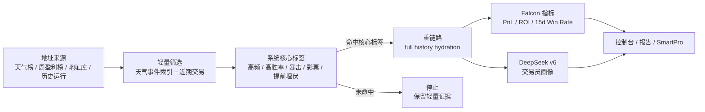

# Finder App

> Polymarket 天气赛道钱包分析工作台：从排行榜、周盈利榜、历史运行和外部地址库里筛出高价值钱包，沉淀结构化标签、完整交易证据、Falcon 指标和 DeepSeek 交易员画像。

[](https://www.python.org/)
[](https://react.dev/)
[](https://vite.dev/)
[](https://www.deepseek.com/)
[](#falcon--deepseek)
[](#data-layout)

Finder App 的核心目标很简单：把天气市场里“值得继续看”的钱包找出来，并且给出能复查、能续跑、能同步的证据链。

- 先轻量筛选，不把每个候选都拖进重链路。
- 先打系统核心标签，再决定是否 full history hydration。
- 命中核心标签后，才生成 DeepSeek v6 深度解读。
- Falcon 负责补充 lifetime PnL、ROI 和 15d win rate。
- 本地 artifacts 和历史 ledger 可复用，结果可继续接力分析。

## 项目一眼看懂

| 模块 | 解决的问题 | 结果 |
| --- | --- | --- |
| 轻量筛选 | 排除非天气、低参与度、噪声钱包 | 更少的无效 full hydration 和 AI 调用 |
| 系统核心标签 | 判断钱包是否有可解释交易特征 | 高频地区、高胜率、暴击、彩票型、提前埋伏等标签 |
| Full hydration | 对核心钱包拉完整交易与操作流 | 更完整的收益、仓位、区域、审计证据 |
| Falcon overlay | 补充外部收益指标 | lifetime PnL、ROI、`Falcon 15d` win rate |
| DeepSeek v6 | 生成交易员视角的钱包画像 | `strategyFocus`、短评、深度笔记、证据级别 |
| 接力分析 | 从历史运行继续未完成地址 | 避免重复跑，保留上下文继续推进 |
| SmartPro 同步 | 把 Finder 结果送回外部地址库 | 结构化导入、观察名单和标签同步 |

## 分析流程



这条门槛不会因为模式不同而放宽。普通分析、本周高盈利榜单、地址库刷新、接力分析都会先走轻量筛选和系统核心标签，再决定是否进入重链路。

## 分析模式

| 模式 | 场景 | 筛选口径 |
| --- | --- | --- |
| 普通分析 | 从天气日榜找新钱包 | 日常排行榜口径，适合小额、近期、高活跃天气钱包 |
| 本周高盈利榜单 | 从周盈利榜找高价值天气钱包 | 独立周榜参数：更高交易量上限、更宽交易笔数范围、支持天气交易占比或天气名义金额占比 |
| Smart Wallet 刷新 | 刷新外部地址库里的已知钱包 | 只处理导入地址，不与普通分析和接力分析混用 |
| 接力分析 | 从历史运行继续未完成地址 | 可按核心标签和 DeepSeek 完成状态筛选来源池 |

当前本周高盈利榜单默认参数：

| 字段 | 默认值 |
| --- | --- |
| `time_period` | `WEEK` |
| `min_pnl` / `max_pnl` | `25` / `2000` |
| `min_volume` / `max_volume` | `500` / `1000000` |
| `min_traded_count` / `max_traded_count` | `5` / `2000` |
| `min_weather_trade_ratio` | `0.2` |
| `min_weather_notional_ratio` | `0.45` |
| `weather_focus_mode` | `trade_or_notional` |

## Falcon & DeepSeek

Falcon 用来补齐外部展示指标：

- `falcon_total_pnl`：Falcon lifetime PnL
- `falcon_total_roi`：Falcon lifetime ROI
- `falcon_win_rate`：Falcon Wallet 360 的窗口胜率
- `falcon_win_rate_window_label`：默认 `Falcon 15d`

DeepSeek v6 用来生成可读的钱包画像：

- prompt 命名空间：`finder-weather-brief-v6`
- 主证据：`behaviorSnapshot`、`coverage`、`tradeSamples`
- 辅助证据：`profileSnapshot`、`operationAuditSnapshot`、`topTrades`
- 输出重点：具体、自然中文、交易员视角、强结论可追溯
- gate 规则：只有系统核心标签和证据足够的钱包才进入生成

## 控制台页面

| 页面 | 主要用途 |
| --- | --- |
| Dashboard | 最近任务、标签分布、重点钱包概览 |
| New analysis | 创建普通分析、本周高盈利榜单、地址库刷新、接力分析 |
| Run status | 查看天气索引、候选预筛、当前批次、hydration、DeepSeek gate reason |
| Wallet list | 钱包列表、搜索、标签筛选、SmartPro 同步 |
| Wallet detail | Falcon 指标、系统标签、证据摘要、交易样本、DeepSeek 深度解读 |
| Reports | 查看报告、JSON 产物与运行文件 |
| History cleanup | 清理缓存、日志、运行产物和归档 |

## 快速启动

### 1. 准备 Python 包

```powershell
pip install -e .
```

也可以直接从源码运行：

```powershell
$env:PYTHONPATH = "$PWD\src"
python -m polymarket_weather_tool --config configs/default_config.json
```

### 2. 准备前端依赖

```powershell
Set-Location frontend
npm ci
```

### 3. 启动本地 API

```powershell
$env:PYTHONPATH = "$PWD\src"
python -m polymarket_weather_tool.server --host 127.0.0.1 --port 41874
```

### 4. 启动控制台

```powershell
Set-Location frontend
npm run dev
```

默认地址：

```text
API:      http://127.0.0.1:41874
Console:  http://127.0.0.1:41873
```

Windows 本地可直接双击启动：

```text
scripts/Open-PolymarketWeather.vbs
scripts/Open-PolymarketWeather.ps1
```

## 桌面快捷方式

推荐桌面图标指向当前仓库启动器：

| 项 | 值 |
| --- | --- |
| Target | `C:\Windows\System32\wscript.exe` |
| Arguments | `"D:\Finder\scripts\Open-PolymarketWeather.vbs"` |
| Working directory | `D:\Finder` |
| Icon | `D:\Finder\frontend\public\polymarket-desktop.ico` |

校正脚本：

```powershell
powershell -ExecutionPolicy Bypass -File scripts/Install-DesktopShortcut.ps1
```

启动器会自动检查前端构建是否过期；如果源码比 `frontend/dist` 更新，会先构建再打开控制台。

## 环境变量

敏感信息不要提交到仓库。复制 `.env.example` 为本地 `.env` 后填入真实值。

| 变量 | 用途 |
| --- | --- |
| `DEEPSEEK_API_KEY` | DeepSeek 生成 |
| `DEEPSEEK_MODEL` | 默认 `deepseek-v4-flash` |
| `DEEPSEEK_BASE_URL` | DeepSeek API base URL |
| `FALCON_API_TOKEN` | Falcon PnL、ROI、Wallet 360 win rate |
| `ETHERSCAN_API_KEY` / `POLYGONSCAN_API_KEY` | 链上验证与 split 证据 |
| `SMART_PRO_BASE_URL` | SmartPro 后台地址 |
| `SMART_PRO_FINDER_TOKEN` | Finder -> SmartPro 同步 token |
| `CLOUDFLARE_ACCOUNT_ID` / `CLOUDFLARE_D1_DATABASE_ID` | 可选 Cloudflare D1 历史层 |

## Data Layout

每次运行通常写入：

```text
artifacts/<run_id>/
  analysis_summary.json
  errors.json
  leaderboard.json
  progress.log
  report.txt
  resolved_config.json
  screening_records.json
  selected_wallets.json
  weather_events.json
  wallets/*.json
```

本地复用数据：

```text
artifacts/_wallet_registry/
artifacts/_history_ledger/
artifacts/_smart_wallet_library/
.cache/falcon/
.cache/finder-ai/
.cache/polymarket-weather-tool/
```

## API

| API | 说明 |
| --- | --- |
| `GET /api/health` | 健康检查 |
| `POST /api/runs` | 创建分析任务 |
| `GET /api/runs` | 列出运行记录 |
| `GET /api/runs/{run_id}/summary` | 运行摘要与诊断 |
| `GET /api/runs/{run_id}/wallets` | 分页读取钱包列表 |
| `GET /api/runs/{run_id}/wallets/{wallet}` | 钱包详情 |
| `POST /api/runs/{run_id}/resume` | 继续未完成任务 |
| `POST /api/runs/{run_id}/relay-import` | 从历史运行构建接力地址池 |
| `POST /api/smart-pro/import/commit` | 同步 Finder 结果到 SmartPro |
| `GET /api/history/cloud/status` | 查看本地 / Cloudflare 历史层状态 |

## 验证

```powershell
python -m unittest discover -s tests -p "test_*.py"
```

```powershell
Set-Location frontend
npm run lint
npm run build
```

## 版本与发布记录

GitHub 首页只保留最近重点，完整更新见版本文件：

| 版本 | 日期 | 重点 |
| --- | --- | --- |
| [0.2.1](docs/release/20260512090000000_falcon_weekly_profit_desktop.md) | 2026-05-12 | Falcon 指标打通、本周高盈利榜单表单修复、桌面入口校正 |
| [0.2.0](docs/release/20260509190000000_finder_ai_v6_relay_analysis.md) | 2026-05-09 | DeepSeek v6、接力分析、运行诊断、核心标签 gate |
| [0.1.1](docs/release/20260507123000000_cloudflare_d1_history_persistence.md) | 2026-05-07 | Cloudflare D1 历史层、GraphQL fallback、归档保护 |
| 0.1.0 | 2026-05-04 | 初始天气钱包分析管线、本地 API、React 控制台 |

更多版本入口：

- [CHANGELOG.md](CHANGELOG.md)
- [docs/release/README.md](docs/release/README.md)

文档结构参考了 GitHub 对仓库 README 的展示机制和 Keep a Changelog 的版本分类方式：

- [GitHub Docs: About READMEs](https://docs.github.com/repositories/managing-your-repositorys-settings-and-features/customizing-your-repository/about-readmes)
- [Keep a Changelog](https://keepachangelog.com/)

## License

本仓库当前未声明开源许可证。如需对外开放复用，请先补充 LICENSE。
